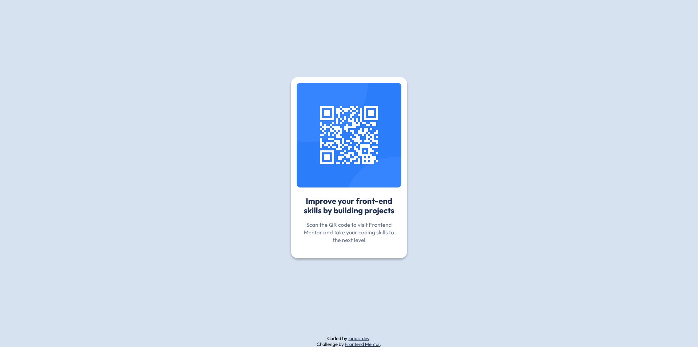

# Frontend Mentor - QR code component solution

This is a solution to the [QR code component challenge on Frontend Mentor](https://www.frontendmentor.io/challenges/qr-code-component-iux_sIO_H). Frontend Mentor challenges help you improve your coding skills by building realistic projects. 

## Table of contents

- [Overview](#overview)
  - [Screenshot](#screenshot)
  - [Links](#links)
- [My process](#my-process)
  - [Built with](#built-with)
  - [What I learned](#what-i-learned)
- [Author](#author)

## Overview

### Screenshot

### Links

- Solution URL: [https://github.com/joaoc-dev/frontendmentor-qr-code-component](https://github.com/joaoc-dev/frontendmentor-qr-code-component)
- Live Site URL: [https://frontendmentor.newbie.qr-code-component.joao-carvalho.dev/](https://frontendmentor.newbie.qr-code-component.joao-carvalho.com/)

## My process

### Built with

- Semantic HTML5 markup
- CSS custom properties
- CSS Grid
- Mobile-first workflow

### What I learned

This simple project provided me with an opportunity to work on how I would structure my files and code from the ground up.

Still a work in progress, and to be improved on with more complex projects.

## Author

- Website - [João Carvalho](https://www.joao-carvalho.dev/)
- Frontend Mentor - [@joaoc-dev](https://www.frontendmentor.io/profile/joaoc-dev)